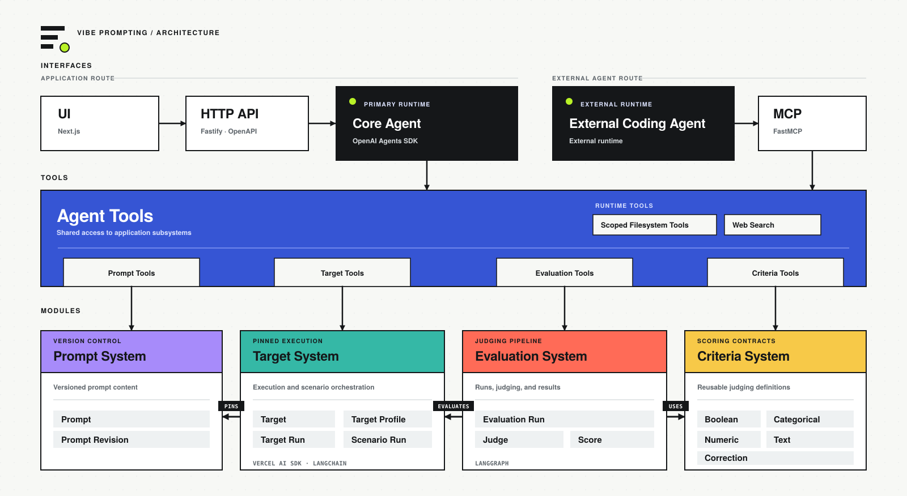

# Vibe Prompting

Vibe Prompting is a backend-first workspace for creating, versioning, refining, running, and evaluating prompts through shared browser, HTTP/OpenAPI, MCP, and agent interfaces.

It keeps four concerns separate: the Prompt System owns versioned prompt content, the Target System owns repeatable execution, the Evaluation System owns judging and results, and the Criteria System owns reusable scoring contracts.

## Architecture



The browser and external coding-agent routes share one Agent Tools surface. Each tool group connects to the module that owns its data and behavior, while evaluation invokes the Target System and uses definitions from the Criteria System.

## Run locally

Requirements: Node.js 24, pnpm 11, and PostgreSQL.

```bash
corepack enable
pnpm install
cp .env.example .env
pnpm db:setup
pnpm dev
```

Configure `.env` with Google OAuth credentials, an invitation code, and credentials for at least one model provider. The default database URL is `postgresql://localhost/vibe_prompting`.

Open [http://localhost:8001](http://localhost:8001).

## Deployment

Production is deployed from `main` through GitHub Actions using:

- Google Cloud Run for the containerized Next.js application and embedded MCP endpoint.
- Google Artifact Registry for Docker images.
- Google Cloud SQL for PostgreSQL storage.
- Google Secret Manager for deployment credentials and connection configuration.
- Google Workload Identity Federation for credential-free GitHub Actions authentication.
- Google OpenID Connect for application sign-in.

The production service runs in Google Cloud's Singapore region (`asia-southeast1`).
