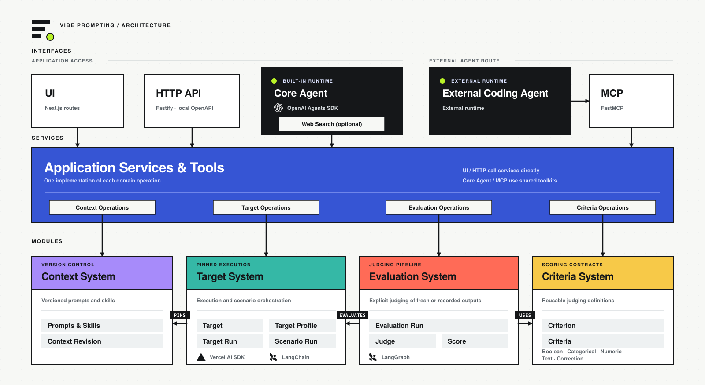

# Vibe Prompting

Vibe Prompting is a backend-first workspace for creating, versioning, refining, running, and evaluating contexts through shared browser, HTTP/OpenAPI, MCP, and agent interfaces.

It keeps four concerns separate: the Context System owns versioned contexts (prompts or skills), the Target System owns repeatable execution, the Evaluation System owns judging and results, and the Criteria System owns reusable scoring contracts.

## Architecture



Browser routes and the local HTTP API call shared application services directly, while the built-in agent and external agents use application toolkits, with external access through MCP. Evaluation judges target outputs using reusable criteria and can score recorded turns without rerunning the target; scenario plans can explicitly request evaluation as part of execution.

The Context Library at `/contexts` shares editing and revision history for both kinds. Prompts supply their full instructions; skills advertise their metadata and load their instructions progressively. Agent tools use `context-library` and `read_context`, `edit_context`, `create_context`, `list_contexts`, and `search_contexts`; isolated editing uses the `context-edit` workflow. API and execution references use `contextId` and `contextRevisionId`.

## Run locally

Requirements: Node.js 24, pnpm 11, and PostgreSQL.

```bash
corepack enable
pnpm install
cp .env.example .env
pnpm db:setup
pnpm dev
```

Configure `.env` with Google OAuth credentials, an invitation code, and credentials for at least one model provider. The default database URL is `postgresql://localhost/vibe_prompting`.

Open [http://localhost:8001](http://localhost:8001).

The optional `pnpm db:seed-example` command imports the existing AI concepts example with a reusable skill revision while retaining its original context revision, recorded conversations, and evaluation history.

## Deployment

Production is deployed from `main` through GitHub Actions using:

- Google Cloud Run for the containerized Next.js application and embedded MCP endpoint.
- Google Artifact Registry for Docker images.
- Google Cloud SQL for PostgreSQL storage.
- Google Secret Manager for deployment credentials and connection configuration.
- Google Workload Identity Federation for credential-free GitHub Actions authentication.
- Google OpenID Connect for application sign-in.

The production service runs in Google Cloud's Singapore region (`asia-southeast1`).
